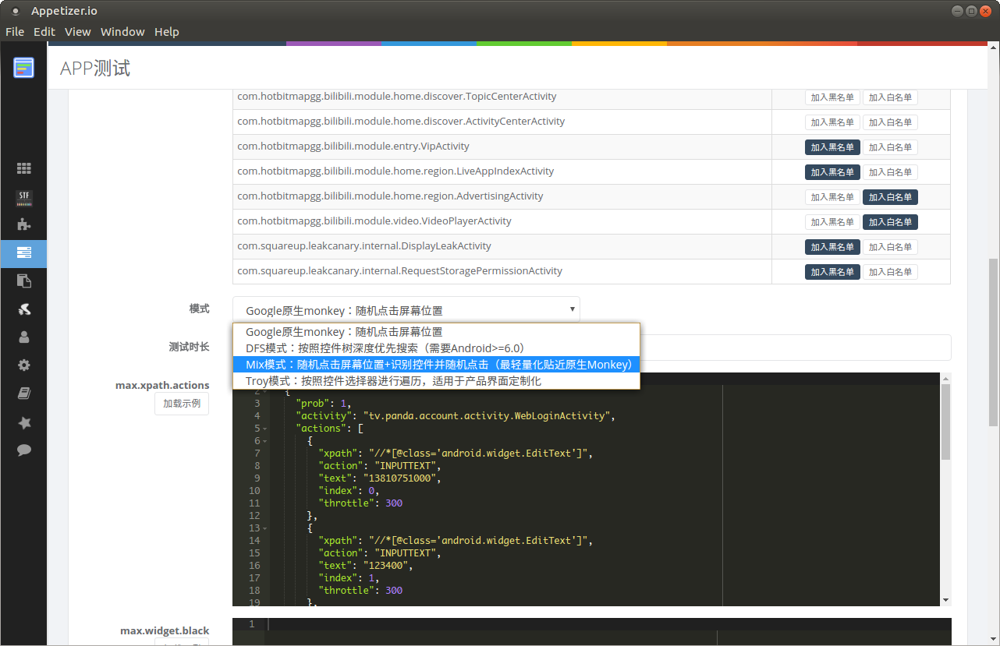
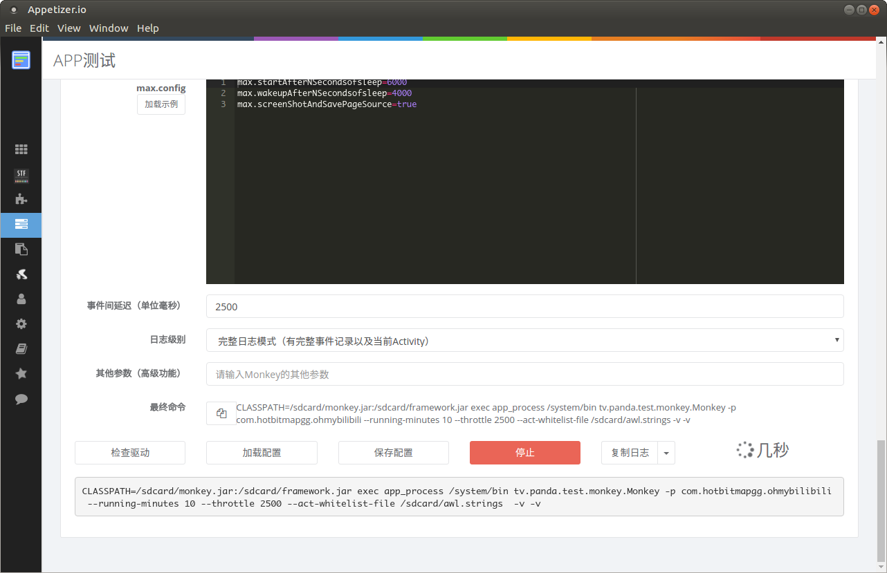
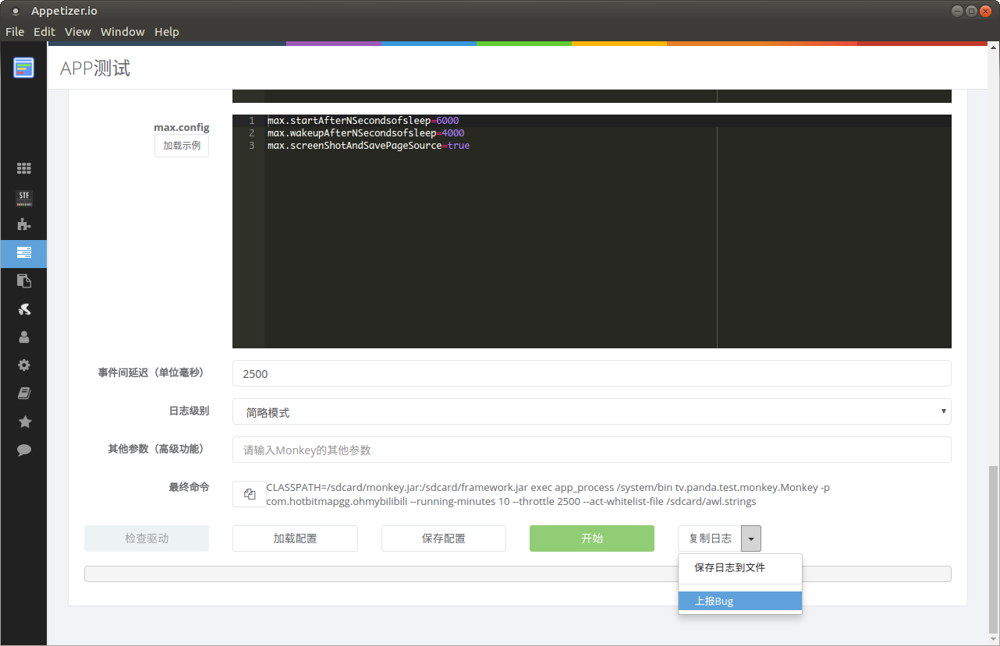

# Maxim 

> An efficient Android Monkey Tester, available for emulators and real devices
> 基于遍历规则的高性能Android Monkey，适用于真机/模拟器的APP UI压力测试

https://testerhome.com/topics/11719

# 环境预备
* 支持 Android 5，6，7，8，9、10、11真机及模拟器;
* 将 framework.jar , monkey.jar push 到手机上某个目录中，建议`/sdcard`
```
adb push framework.jar /sdcard
adb push monkey.jar /sdcard
```

# 图形化界面
下载 [AppetizerIO](https://appetizer.io/cn/)：`APP测试->UI压力测试`，支持多种模式，黑白名单，所有配置文件（自动json语法查错），测试开始前自动push配置文件



|  测试过程log实时更新  | 一键错误log上报作者 |
|:-----------------:| :---------------:
|   ||

# 命令行模式
cmd 命令 ：
`adb shell CLASSPATH=/sdcard/monkey.jar:/sdcard/framework.jar exec app_process /system/bin tv.panda.test.monkey.Monkey -p com.panda.videoliveplatform --uiautomatormix --running-minutes 60 -v -v`

* `tv.panda.test.monkey.Monkey`： monkey入口类，不要修改
* `com.panda.videoliveplatform`： 被测app包名，需要修改
* `--uiautomatormix`： 遍历策略

# 策略

1. 模式 Mix (基于事件概率的压力测试)
   ```
   --uiautomatormix
   直接使用底层accessibiltyserver获取界面接口 解析各控件，随机选取一个控件执行touch操作。
     同时与原monkey 其他操作按比例混合使用
     默认accessibilityserver action占比50%，其余各action分剩余的50%
     accessibilityserver action占比可配置 --pct-uiautomatormix n
   ```

2. 模式 DFS （建议，遍历可用Fastbot https://github.com/bytedance/Fastbot_Android）
  ```
  --uiautomatordfs
  深度遍历算法
  ```

3. 模式Troy （建议，遍历可用Fastbot https://github.com/bytedance/Fastbot_Android）
  ```
  --uiautomatortroy
  控件选择策略按max.xpath.selector配置的高低优先级来进行深度遍历
  ```

4. 保留原始monkey

5. 总运行时长
  --running-minutes 3  运行3分钟

6. --act-whitelist-file  /sdcard/awl.strings    定义白名单
   --act-blacklist-file

其他参数与原始monkey一致


# changelog

## 20180112 增加防跳出及切回、防误点状态栏及下拉状态栏
## 20180115 增加防睡眠及睡眠唤醒、防假死及自拉活机制
## 20180116 增加随机输入
随机输入 需要提前安装adbkeyboard 
https://github.com/senzhk/ADBKeyBoard
随机输入默认随机输入字符，内容可自定义配置，格式如ape.strings文件，每行为随机输入项。
## 20180118 增加Activity黑白名单 格式如awl.strings，可对跳转做更细粒度控制，比如控制仅在几个特定Activity中跑monkey

## 20180119 framework兼容 Android5, 6, 7, 8.0 
Android5 不支持dfs 模式，因5的accessibiltyserver缺少一个api。故不支持 
增加 APP崩溃时自动保存堆栈信息到 `/sdcard/crash-dump.log` 注 追加保存

## 20180211增加max.config项
max.startAfterNSecondsofsleep = 6000 启动后sleep 6秒,可自定义
max.wakeupAfterNSecondsofsleep = 4000 唤醒后

## 20180223 增加特殊事件
配置 `max.xpath.actions`, 案例
```js
[
{
    "prob": 1,
    "activity":"tv.panda.account.activity.WebLoginActivity",
    "actions": [
        {
            "xpath": "//*[@class='android.widget.EditText']",
            "action": "INPUTTEXT",
            "text": "13810751000",
            "index": 0,
            "throttle": 300
        },
        {
            "xpath": "//*[@class='android.widget.EditText']",
            "action": "INPUTTEXT",
            "text": "123400",
            "index": 1,
            "throttle": 300
        },
        {
            "xpath": "//*[@content-desc='登录' and @class='android.view.View']",
            "index": 0,
            "action": "CLICK",
            "throttle": 1000
        }]
},
{
     "prob": 1,
     "actions": [
     {
             "xpath": "//*[@class='android.view.View']",
             "index": 0,
             "action": "SWIPE",
             "args": "10,1000,800,1000,100",
             "throttle": 3000
         }]
 },
{
     "prob": 1,
     "actions": [
     {
             "xpath": "//*[@class='android.view.View']",
             "index": 0,
             "action": "TOUCH",
             "args": "500,1000",
             "throttle": 1000
         }]
},
{
     "prob": 1,
     "actions": [
     {
             "xpath": "//*[@class='android.view.View']",
             "index": 0,
             "action": "KEYEVENT",
             "keycode": 4,
             "throttle": 1000
         }]
}
]
```
上述包含3个特殊事件
发生概率prob =1 为100%发生
仅当 当前activity 为 `tv.panda.account.activity.WebLoginActivity` 时或无activity配置时做事件查找
xpath 为待查找控件的xpath 支持复杂型xpath，支持 index 索引选择
throttle 为该特殊步骤执行完后sleep n 毫秒
Action 支持
1. Click 点击匹配到的xpath控件
2. INPUTTEXT 在匹配到的xpath控件中输入 text 指定字符，输入需要提前安装adbkeyboard
3. TOUCH  点击指定坐标  args = (x,y)
4. SWIPE  按执行路径滑动 args = (x1,y1,x2,y2,step)
5. KEYEVENT 执行键盘事件 keycode   

注 配置完成后请贴在 json.cn 检查格式，注意” : , 非中文
将该文件 push 到 `/sdcard/max.xpath.actions`

## 20180228 增加黑控件 黑区域屏蔽
配置max.widget.black
案例
```js
[
{
    "activity":"com.panda.videoliveplatform.activity.MainFragmentActivity",
    "xpath": "//*[@class='android.widget.TextView' and @text='我的校园' and @resource-id='com.panda.videoliveplatform:id/tv_title']"
},
{
    "activity":"com.panda.videoliveplatform.activity.MainFragmentActivity",
    "xpath": "//*[@class='android.widget.TextView' and @text='车队' and @resource-id='com.panda.videoliveplatform:id/tv_title']",
    "index": 0,
    "bounds": "[0,633][900,789]"
},
{
    "activity":"com.panda.videoliveplatform.activity.MainFragmentActivity",
    "bounds": "[0,1107][900,1263]"
}
]
```
当且仅当 当前activity == 所配activity 或未配activity时 做黑检查
三种方式:
1. 仅配置bounds
   屏蔽某个区域，在该区域内的控件或坐标不会被点击。
2. 配置xpath
   查找匹配的控件，屏蔽点击该控件。
3. xpath+bounds
   查找匹配的控件，当控件存在时屏蔽指定的区域。

注 配置完成后请贴在 json.cn 检查格式，注意” : , 非中文
将该文件 push 到 `/sdcard/max.widget.black`

## 20180308 截图及dump xml
配置`max.config`
```
max.takeScreenShot   开启截图
max.savePageSource  保存xml 

```
 
截图的生效条件: `throttle > 200  &&  max.takeScreenShot = true`

案例：
`adb shell CLASSPATH=/sdcard/monkey.jar:/sdcard/framework.jar exec app_process /system/bin tv.panda.test.monkey.Monkey -p com.panda.videoliveplatform --uiautomatormix --running-minutes 6 -v -v --throttle 400 --output-directory /sdcard/max1/`

备注：每分钟100-200截图，故因大量截图对手机空间要求较高，仅为复现崩溃时建议开启截图

## 20180322 增加TROY模式

`adb shell CLASSPATH=/sdcard/monkey.jar:/sdcard/framework.jar exec app_process /system/bin tv.panda.test.monkey.Monkey -p com.panda.videoliveplatform --uiautomatortroy --running-minutes 15 -v -v `

配置max.xpath.selector 控件优先级
```js
[
{
    "firstList":
    [
        {  "xpath": "//*[contains(@text,'绝地求生')]" }
    ],
    "selectList":
    [
        {  "xpath": "//*[@clickable='true']" },
        {  "xpath": "//*[@clickable='true']//*[contains(name(),'Text')]" },
        {  "xpath": "//*[@clickable='true']//*[contains(name(),'Button')]" },
        {  "xpath": "//*[@clickable='true']//*[contains(name(),'Image')]" }
    ],
    "lastList":
    [
        {  "xpath": "//*[../*[@selected='true']]" },
        {  "xpath": "//*[../../*/*[@selected='true']]" },
        {  "xpath": "//*[../../*/*[@selected='true'] and contains(@resource-id,'tab_')]" },
        {  "xpath": "//*[contains(@resource-id,'HorizontalScrollView')]" }
    ],
    "blackList":
    [
        {  "xpath": "//*[contains(@resource-id,'wrapper_in_custom_title_bar')]//*[contains(@resource-id,'right_button')]" },
        {  "xpath": "//*[contains(@resource-id,'share')]" }
    ]
}
]
```
控件选择策略会按 1first 2select 3last 并屏蔽black来执行遍历

max.xpath.selector 需要push 到/sdcard/
 
##20180517 增加随机测试多个app  

adb shell CLASSPATH=/sdcard/monkey.jar:/sdcard/framework.jar exec app_process /system/bin tv.panda.test.monkey.Monkey --uiautomatormix --running-minutes 150 -v -v --system  /sdcard/apps.strings  

apps.strings格式如下：  
com.panda.videoliveplatform  
com.google.android.calculator  
com.android.chrome  

其中每个app随机跑5-15分钟  
  
    
 ## 20180725 增加崩溃回溯截图    
 
 运行时shell增加 --imagepolling 参数 ， 开启崩溃回溯截图、关闭原截图逻辑  
当崩溃发生时 进行截图保存，实现可回溯崩溃场景，默认会在 /sdcard/crash_$timestamp/图  

配置`max.config`  
```
max.takeScreenShot =True  开启截图  
max.flushImagesThreshold  =50 回溯区间大小xx张  
```
 
截图的生效条件: `throttle > 200  &&  max.takeScreenShot = true &&  --imagepolling`  


 ## 2019.08.16 支持更多事件
  mix 增加 back event 默认事件占比10%
  ```
    --pct-back 5 （设置占比5）
  ```
  mix 增加 重启app event 默认事件占比0.3%
  ```
    --pct-reset 0 (关闭重启 事件)
  ```
  mix 增加 null intent event 默认事件占比0.2% 该事件探测app中exported组件，随机发null intent
  ```
   --pct-nullintent 0 (关闭null intent 事件)
  ```

  增加monkey api
  ```
    如何使用：
    1）先启动monkey
    adb shell CLASSPATH=/sdcard/monkey.jar:/sdcard/framework.jar exec app_process /system/bin tv.panda.test.monkey.Monkey -p com.panda.videoliveplatform --uiautomatorapi --running-minutes 100 -v -v -v -v
    2）adb shell netcfg 查看ip
    3) 结合Monkeyapi.py编写自己的test.py

    目前提供了如下接口
    1）dumptree
    getXml()
    2) 点击
    click(500,550)
    3）back
    back()
    4) 截屏base64
    getScreenShotBase64()


    demo
    https://github.com/zhangzhao4444/Maxim/blob/master/MonkeyApi.py 无须修改
    https://github.com/zhangzhao4444/Maxim/blob/master/test.py
  ```

  ## 2020.12.09 支持11
  ```
  兼容 Android11

  下线dfs code
  ```

  ## 2020.12.21 恢复dfs mode


<hr>


## 1. Requirements

- Android 5/6/7/8/9/10/11


## 2. Installation
```
adb push framework.jar /sdcard
adb push monkey.jar /sdcard
```
Optionally, push configuration file(s)
```
adb push ape.strings /sdcard
adb push awl.strings /sdcard

```
## 3. Usage 

Maxim is started from adb shell 
```
adb shell CLASSPATH=/sdcard/monkey.jar:/sdcard/framework.jar exec app_process /system/bin tv.panda.test.monkey.Monkey -p com.panda.videoliveplatform --uiautomatordfs 5000
```

### Modes
* mix mode:  `--uiautomatormix`  use AccessibilityService to resolve view tree and mix vanilla monkey events with view clicks.  About 10-20 actions per second.
  * `--pct-uiautomatormix`   ratio (percentage number)

### Timing control
* `--running-minutes  n`  run for n minutes

### Optional configuration (rules)

* `--act-whitelist-file` e.g., /sdcard/awl.strings white list for activities
* `--act-blacklist-file`
* `max.xpath.actions`  to specify special event, see example
